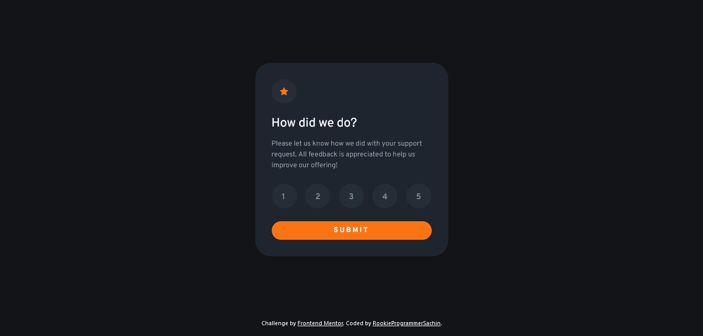
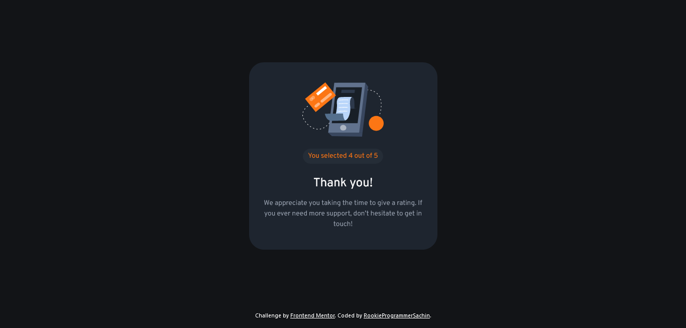

# Frontend Mentor - Interactive rating component solution

This is a solution to the [Interactive rating component challenge on Frontend Mentor](https://www.frontendmentor.io/challenges/interactive-rating-component-koxpeBUmI). Frontend Mentor challenges help you improve your coding skills by building realistic projects. 

## Table of contents

- [Overview](#overview)
  - [The challenge](#the-challenge)
  - [Screenshot](#screenshot)
  - [Links](#links)
- [My process](#my-process)
  - [Built with](#built-with)
  - [What I learned](#what-i-learned)
- [Author](#author)


## Overview

### The challenge

Users should be able to:

- View the optimal layout for the app depending on their device's screen size
- See hover states for all interactive elements on the page
- Select and submit a number rating
- See the "Thank you" card state after submitting a rating

### Screenshot





### Links

- Solution URL: [https://www.frontendmentor.io/solutions/interactive-rating-component-with-states-managed-by-js-cbTPNKFsMQ](https://www.frontendmentor.io/solutions/interactive-rating-component-with-states-managed-by-js-cbTPNKFsMQ)
- Live Site URL: [https://rookieprogrammersachin.github.io/FrontEndMentor-InteractiveRatingComponent/](https://rookieprogrammersachin.github.io/FrontEndMentor-InteractiveRatingComponent/)

## My process

### Built with

- HTML5 markup
- CSS custom properties
- Flexbox
- Desktop-first workflow
- Sass

### What I learned

Learnt how to create and integrate HTML elements with CSS styling into a webpage with trigger from click event.

Also figured out own JS logic to manage the rating buttons lighting up


```js
      curRating = parseInt(event.target.value)
      for( let i=0; i<curRating; i++ ){
        btnRatingContainer.children[i].classList.add("clicked");
      }
```
## Author

- Website - [RookieProgrammerSachin](https://github.com/RookieProgrammerSachin)
- Frontend Mentor - [@RookieProgrammerSachin](https://www.frontendmentor.io/profile/RookieProgrammerSachin)
- LinkedIn - [Sachin Sharon](https://www.linkedin.com/in/sachin-sharon-481b6b242/)
